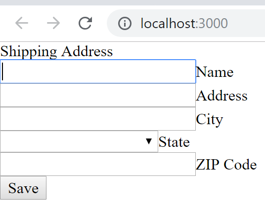

# mdc101
MDC Web Codelabs Adapted for React with Hooks/TypeScript/CRA
## Motivation
This is a 5-part series of the MDC codelabs starting with [MDC101](https://codelabs.developers.google.com/codelabs/mdc-101-web/) 
I'll initialize the project with **npx create-react-app . --typescript** (CRA) 
Then I'll try to make the tutorials both with and without SASS. I'm not sure, if SASS can be used with a CRA project. SASS is the recommended way of [using MDC Web](https://github.com/material-components/material-components-web/blob/master/docs/getting-started.md#using-mdc-web-with-sass-and-es2015)

## MDC111
### Initialization with CRA/TypeScript, SASS, React Hooks and MDC Web
This is a branch directly from the empty master root for [MDC111](https://codelabs.developers.google.com/codelabs/mdc-111-web) from the Google MDC Web codelab series.
CRA a projects a perfectly fine for SASS, just node-sass, rename the css files to scss where you want to use SASS syntax, and set SASS_PATH to node_modules.
- **npx create-react-app . --typescript**
- **npm install react@next react-dom@next** for React Hooks 16.7.0-alpha.2
- **npm install node-sass**
- **set SASS_PATH=.\node_modules**
- **npm install material-components-web** for MDC Web

### Copying Startup Files from Original MDC111
- Copy _variables, _layout, _theme, app SCSS files
- Delete App.css, index.css, logo.svg
- Replace title in public/index.html to **Shipping Address**
- Add links to index.html:
```
    <link rel="shortcut icon" href="https://material.io/favicon.ico"/>
    <link rel="stylesheet" href="https://cdnjs.cloudflare.com/ajax/libs/normalize/8.0.0/normalize.min.css"/>
```
- Copy the body contents from index.html into App.tsx
```
  <header class="crane-header">
    Shipping Address
  </header>

  <main class="crane-main">
    <form method="post" action="." id="crane-shipping-form">
      <div class="crane-row">
        <div class="crane-field">
          <input class="crane-input" id="crane-name-input" type="text" required autofocus>
          <label class="crane-label" for="crane-name-input">
            Name
          </label>
        </div>
      </div>
      <div class="crane-row">
        <div class="crane-field">
          <input class="crane-input" id="crane-address-input" type="text" required>
          <label class="crane-label" for="crane-address-input">
            Address
          </label>
        </div>
      </div>
      <div class="crane-row">
        <div class="crane-field">
          <input class="crane-input" id="crane-city-input" type="text" required>
          <label class="crane-label" for="crane-city-input">
            City
          </label>
        </div>
      </div>
      <div class="crane-row">
        <div class="crane-field">
          <select class="crane-input" id="crane-state-input" required>
            <option value="" selected></option>
            <option value="AL">Alabama</option>
            <option value="AK">Alaska</option>
            <option value="AZ">Arizona</option>
            <option value="AR">Arkansas</option>
            <option value="CA">California</option>
            <option value="CO">Colorado</option>
            <option value="CT">Connecticut</option>
            <option value="DE">Delaware</option>
            <option value="DC">District Of Columbia</option>
            <option value="FL">Florida</option>
            <option value="GA">Georgia</option>
            <option value="HI">Hawaii</option>
            <option value="ID">Idaho</option>
            <option value="IL">Illinois</option>
            <option value="IN">Indiana</option>
            <option value="IA">Iowa</option>
            <option value="KS">Kansas</option>
            <option value="KY">Kentucky</option>
            <option value="LA">Louisiana</option>
            <option value="ME">Maine</option>
            <option value="MD">Maryland</option>
            <option value="MA">Massachusetts</option>
            <option value="MI">Michigan</option>
            <option value="MN">Minnesota</option>
            <option value="MS">Mississippi</option>
            <option value="MO">Missouri</option>
            <option value="MT">Montana</option>
            <option value="NE">Nebraska</option>
            <option value="NV">Nevada</option>
            <option value="NH">New Hampshire</option>
            <option value="NJ">New Jersey</option>
            <option value="NM">New Mexico</option>
            <option value="NY">New York</option>
            <option value="NC">North Carolina</option>
            <option value="ND">North Dakota</option>
            <option value="OH">Ohio</option>
            <option value="OK">Oklahoma</option>
            <option value="OR">Oregon</option>
            <option value="PA">Pennsylvania</option>
            <option value="RI">Rhode Island</option>
            <option value="SC">South Carolina</option>
            <option value="SD">South Dakota</option>
            <option value="TN">Tennessee</option>
            <option value="TX">Texas</option>
            <option value="UT">Utah</option>
            <option value="VT">Vermont</option>
            <option value="VA">Virginia</option>
            <option value="WA">Washington</option>
            <option value="WV">West Virginia</option>
            <option value="WI">Wisconsin</option>
            <option value="WY">Wyoming</option>
          </select>
          <label class="crane-label" for="crane-state-input">
            State
          </label>
        </div>
        <div class="crane-field">
          <!--
            Note: `pattern="[0-9]*"` tells Safari on iPhone to display a large numeric keypad without decimal points.
            See https://www.filamentgroup.com/lab/type-number.html
          -->
          <input class="crane-input" id="crane-zip-code-input"
                 type="text" required minlength="5" maxlength="5" pattern="[0-9]*">
          <label class="crane-label" for="crane-zip-code-input">
            ZIP Code
          </label>
        </div>
      </div>
      <div class="crane-row crane-row--submit">
        <button type="submit" class="crane-button">Save</button>
      </div>
    </form>
  </main>
```
- Now you will have a lot of errors:
  - Replace class to **className** in the entire HTML block
  - Close the input elements with forward slash like so
  ```<input className="crane-input" id="crane-name-input" type="text" required autoFocus/>```
  - Rename autofocus to **autoFocus** in input and for to **htmlFor** in label elements.
  - Replace minlength, maxlength in input elements like so: **minLength={5} maxLength={5}**
  - Include the HTML comment block into a JS comment block like so: ```{/*<!-- Note: ... -->*/}```
  - Sandwitch the entire HTML block into a React fragment block and refactor App to a default function components like so
  ```
  export default function App() {
    return (
      <>
        <header className="crane-header">
        ...
        </main>
      </>
    )
  }
  ```
- Delete the references to App.css and index.css from App.tsx and intex.tsx
- npm start and chekout the result<br/> 

- import app.scss into App.tsx and you will get a nicely styled form:<br/>


### Commit Changes: Initial Shipping Address Form Added
This series of steps is a perfect scenario how to initialize a CRA/TypeScrip/React Hook project for MDC Web/SASS.
After this series of steps you will have a clean excellent starting point for any applications.
So far so good and I love this project. 
